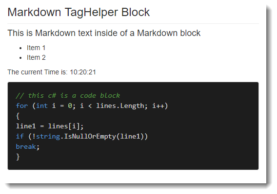

---
title: Creating an ASP.NET Core Markdown TagHelper and Parser
abstract: A couple of months ago I wrote about creating a WebForms based Markdown control. This time around I'll build an ASP.NET Core MVC TagHelper that performs similar functionality for embedding Markdown text into a content area of a Razor page. The component also includes easy access to a Markdown parser using the blazing fast MarkDig Markdown parser.
keywords: Markdown, TagHelper, ASP.NET Core
categories: ASP.NET Core, Markdown
weblogName: West Wind Web Log
postId: 708211
postDate: 2018-03-23T01:11:43.8926586-10:00
---
# Creating an ASP.NET Core Markdown TagHelper and Parser


A few months ago I wrote about creating a [literal Markdown Control for WebForms](https://weblog.west-wind.com/posts/2017/Sep/13/A-Literal-Markdown-Control-for-ASPNET-WebForms), where I described a simple content control that takes the content from within a tag and parses the embedded Markdown and then produces HTML output in its stead. I created a WebForms control mainly for selfish reasons, because I have tons of semi-static content on my content sites that still live in classic ASP.NET ASPX pages.

Since I wrote that article I've gotten a lot of requests to write about an ASP.NET Core version for something similar and - back to my own selfishishness - I'm also starting to deploy a few content heavy sites that have mostly static html content that would be well served by Markdown using ASP.NET Core and Razor Pages. So it's time to build an ASP.NET Core version by creating a `<markdown>` TagHelper.

There are already a number of implementations available, but I'm a big fan of the [MarkDig Markdown Parser](https://github.com/lunet-io/markdig), so I set out to create an **ASP.NET Core Tag Helper** that provides the same functionality as the WebForms control I previously created.

Using the TagHelper you can render Markdown like this inside of a Razor Page:

```html
<markdown>
    #### This is Markdown text inside of a Markdown block

    * Item 1
    * Item 2
 
    ### Dynamic Data is supported:
    The current Time is: @DateTime.Now.ToString("HH:mm:ss")

    ```cs
    // this c# is a code block
    for (int i = 0; i < lines.Length; i++)
    {
        line1 = lines[i];
        if (!string.IsNullOrEmpty(line1))
            break;
    }
    ```
</markdown>
```

The Markdown is expanded into HTML to replace the markdown TagHelper content.

You can also bind to Model values using the `markdown` attribute:

```html
@model MarkdownModel

<markdown markdown="Model.MarkdownText" />
```

You can also easily parse Markdown both in code and inside of Razor Pages:

```cs
string html = Markdown.Parse(markdownText)
```

Inside of Razor code you can do:

```html
<div>@Markdown.ParseHtmlString(Model.ProductInfoMarkdown)</div>
```


## Get it
The packaged component includes the TagHelper and a simple way to parse Markdown in code or inside of a Razor Page.

It's available as a [NuGet Package](https://www.nuget.org/packages/Westwind.AspNetCore.Markdown):

```
PM> Install-Package Westwind.AspNetCore.Markdown
```

And you can take a look at the source code on Github:

* [Westwind.AspNetCore.Markdown on GitHub](https://github.com/RickStrahl/Westwind.AspNetCorehttps://github.com/RickStrahl/Westwind.AspNetCore)

## Why do I need a Markdown Control?
Let's take a step back - why would you even need a content control for Markdown Parsing?

Markdown is everywhere these days and I for one have become incredibly dependent on it for a variety of text scenarios. I use it for blogging, for documentation both for code on Git repos and actual extended documentation. I use it for note keeping and collaboration in Gists or Github Repos, as well as a data entry format for many applications that need to display text content a little bit more richly than using plain text. Since I created the Markdown control I've also been using that extensively for quite a bit of my static content and it's made it much easier to manage some of my content this way.

### What does it do?
The main reason for this component is the ability to **embed** Markdown into content with a simple tag that gets parsed into HTML at runtime. This is very useful for content pages that contain a lot of raw static text. It's a lot easier to write Markdown text in content pages than it is to write HTML tag soup consisting of `<p>`,`<ul>` and `<h3>` tags. Markdown is a heck of a lot more comfortable to type and maintain and this works well for common text content. It won't replace HTML for markup for an entire page, but it can be a great help with large content blocks inside of a larger HTML page. 

In this post I'll create `<markdown>` TagHelper that can convert inline Markdown like this:

```html
<h3>Markdown Tag Helper Block</h3>

<markdown>
    #### This is Markdown text inside of a Markdown block

    * Item 1
    * Item 2
 
    ### Dynamic Data is supported:
    The current Time is: @DateTime.Now.ToString("HH:mm:ss")

    ```cs
    // this c# is a code block
    for (int i = 0; i < lines.Length; i++)
    {
        line1 = lines[i];
        if (!string.IsNullOrEmpty(line1))
            break;
    }
    ```
</markdown>
```

The content of the control is rendered to HTML at runtime which looks like this:



The above renders with default Bootstrap styling of an ASP.NET Core MVC default Web site plus [hilightjs](https://highlightjs.org/) for the code highlighting. You can check out the full [`Markdown.cshtml` page on Github](https://github.com/RickStrahl/Westwind.AspNetCore/blob/master/SampleWeb/Pages/Markdown.cshtml). The code of that page also includes the highlightjs hookup code to make the source code sample look nice.

It's important to understand that rendered Markdown is **just HTML** there's nothing in Markdown that handles styling of the content - that's left up to the host site or tool that displays the final HTML output. Any formatting comes from the host application, in this case the stock ASP.NET Core template for sample purposes.

Using this control allows you to easily create content areas inside of HTML documents that are rendered from Markdown. You write Markdown, the control renders HTML at runtime.

As part of this component I'll also provide a simple way to parse Markdown in code and inside of @RazorPages.

## Creating a Markdown TagHelper
Before we dive in let's briefly discuss what TagHelpers are for those of you new to ASP.NET Core and then look at what it takes to create one. 

### What is a TagHelper?
TagHelpers are a new feature for ASP.NET Core MVC, and it's easily one of the nicest improvements for server side HTML generation. TagHelpers are self contained components that are embedded into a **@Razor** page. TagHelpers look like HTML tags and unlike Razor expressions (@Expression) feel natural inside of standard HTML content in a Razor page. 

Many of the existing Model binding and HTML helpers in ASP.NET have been replaced by TagHelpers and TagHelper behaviors that allow you to directly bind to HTML controls in a page. For example, here is an Input tag bound to a model value.

For example:

```html
<input type="email" asp-for="Email" 
       placeholder="Your email address"
       class="form-control"/>
```

where `asp-for` extends the `input` element with an extension attribute to provide the model binding to the value property. This replaces:

```html
@Html.TextBoxFor(model => model.Email, 
                 new { @class = "form-control",
                      placeholder = "your email address", 
                      type = "email" })
```

Which would you rather use? :-) TagHelpers make it easier to write your HTML markup by sticking to standard HTML syntax which feels more natural than using Razor expressions.

### Make your own TagHelpers
Another important point is that it's very easy to create your own TagHelpers which is the focus of this post. The interface to create a TagHelper is primarily a single method interface that takes a Context input to get element, tag and content information and an output string that has to be generated of for the actual TagHelper output. Using this approach feels very natural and makes it easy to create your own tag helpers with minimal fuss.

A TagHelper encapsulates rendering logic via a very simple `ProcessAsync()` interface that renders a chunk of HTML content into the page at the location the TagHelper is defined. The `ProcessAsync()` method takes a TagHelper Context as input to let you get at the element and attributes for input, and provides an output that you can write string output to generate your embedded content. As we'll see it takes very little code to create a very useful TagHelper.

In order to use TagHelpers they have to be registered with MVC, either in the page or more likely in the `_ViewImports.cshtml` page of the project.

To create a Tag Helper these are the things you typically need to do:

* Create a new Class and Inherit from `TagHelper`
* Create your TagHelper implementation via `ProcessAsync()` or `Process()`.
* Register your TagHelper in `_ViewImports.cshtml`
* Reference your TagHelper in your pages
* Rock on!

### Creating the MarkdownTagHelper Class
For the `<markdown>` TagHelper I want to create a content control whose content can be retrieved and parsed as Markdown and then converted into HTML. Optionally you can also use a `Markdown` property to bind Markdown for rendering - so if you have Markdown as part of data in your model you can bind it to this property/attribute in lieu of static content you provide.

Here's the base code for the `MarkdownTagHelper` that accomplishes these tasks:

```cs
[HtmlTargetElement("markdown")]
public class MarkdownTagHelper : TagHelper
{
    [HtmlAttributeName("normalize-whitespace")]
    public bool NormalizeWhitespace { get; set; } = true;

    [HtmlAttributeName("markdown")]
    public ModelExpression Markdown { get; set; }

    public override async Task ProcessAsync(TagHelperContext context, TagHelperOutput output)
    {
        await base.ProcessAsync(context, output);

        string content = null;
        if (Markdown != null)
            content = Markdown.Model?.ToString();

        if (content == null)            
            content = (await output.GetChildContentAsync()).GetContent();

        if (string.IsNullOrEmpty(content))
            return;

        content = content.Trim('\n', '\r');

        string markdown = NormalizeWhiteSpaceText(content);            

        var parser = MarkdownParserFactory.GetParser();
        var html = parser.Parse(markdown);

        output.TagName = null;  // Remove the <markdown> element
        output.Content.SetHtmlContent(html);
    }

}
```

Before you can use the TagHelper in a page you'll need to register it with the MVC application by sticking the following into the `_ViewImports.cshtml`:

```html
@addTagHelper *, Westwind.AspNetCore.Markdown
```

Now you're ready to use the TagHelper:

```html
<markdown>This is **Markdown Text**. Render me!</markdown>
```

As you can see the code to handle the actual processing of the markdown is very short and easy to understand. It grabs either the content of the `<markdown>` element or the `markdown` attribute and then passes that to the the Markdown Parser to process. The parser turns the Markdown text into HTML which is the written out as HTML content using `output.Content.SetHtmlContent()`.

The code uses an abstraction for the Markdown Parser so the parser can be more easily replaced in the future without affecting the TagHelper code. I've gone through a few iterations of Markdown Parsers before landing on MarkDig, and I use this code in many places where I add Markdown parsing. I'll come back to the Markdown Parser in a minute.

### Markdown Attribute and DataBinding
In addition to the content you can also bind to the `markdown` attribute which allows for programmatic assignment and databinding.

```
@model MarkdownModel
@{
    Model.MarkdownText = "This is some **Markdown**!";
}

<markdown markdown="Model.MarkdownText" />
```

The `markdown` attribute accepts binding expressions you can bind Markdown for display from model values or other expressions easily.

### Normalizing Markdown Text
One issue with using a TagHelper or Control for Markdown is that Markdown expects no margins in the Markdown text to process.

If you have Markdown like this:

```html
<markdown>
    #### This is Markdown text inside of a Markdown block

    * Item 1
    * Item 2
 
    ### Dynamic Data is supported:
    The current Time is: @DateTime.Now.ToString("HH:mm:ss")

    ```cs
    // this c# is a code block
    for (int i = 0; i < lines.Length; i++)
    {
        line1 = lines[i];
        if (!string.IsNullOrEmpty(line1))
            break;
    }
    ```
</markdown>
```

and leave this Markdown in its raw form with the indent, the Markdown parser would render the entire Markdown text as a **code block**, because the text is indented with 4 spaces which is constitutes a code block in Markdown. Not what we want here!

This is where the `NormalizeWhiteSpace` property comes into play. This flag, which is `true` by default, determines whether leading repeated white space is stripped from the embedded Markdown block. 

Here's the code to strip leading white space:

```cs
string NormalizeWhiteSpaceText(string text)
{
    if (!NormalizeWhitespace || string.IsNullOrEmpty(text))
        return text;

    var lines = GetLines(text);
    if (lines.Length < 1)
        return text;

    string line1 = null;

    // find first non-empty line
    for (int i = 0; i < lines.Length; i++)
    {
        line1 = lines[i];
        if (!string.IsNullOrEmpty(line1))
            break;
    }

    if (string.IsNullOrEmpty(line1))
        return text;

    string trimLine = line1.TrimStart();
    int whitespaceCount = line1.Length - trimLine.Length;
    if (whitespaceCount == 0)
        return text;

    StringBuilder sb = new StringBuilder();
    for (int i = 0; i < lines.Length; i++)
    {
        if (lines[i].Length > whitespaceCount)
            sb.AppendLine(lines[i].Substring(whitespaceCount));
        else
            sb.AppendLine(lines[i]);
    }

    return sb.ToString();
}

string[] GetLines(string s, int maxLines = 0)
{
    if (s == null)
        return null;

    s = s.Replace("\r\n", "\n");

    if (maxLines < 1)
        return s.Split(new char[] { '\n' });

    return s.Split(new char[] { '\n' }).Take(maxLines).ToArray();
}
```

This code works by looking at the first non-empty line and checking for leading White space. It captures this white space and then removes that same leading whitespace from all lines of the content. This works as long as the Markdown Block uses consistent white space for all lines (ie. all tabs or all n spaces etc.).

If `normalize-whitespace="false"` in the document, you can still use the TagHelper but you have to ensure the that text is left justified in the saved razor file. This is hard if you're using Visual Studio as it'll try to reformat the doc and re-introduce the whitespace, so the default for this attribute is `true`.

To look at the complete code for this class you can check the code on Github:

* [MarkdownTagHelper.cs](https://github.com/RickStrahl/Westwind.AspNetCore/blob/master/Westwind.AspNetCore.Markdown/MarkdownTagHelper.cs)
RickStrahl

### Razor Expressions in Markdown
If you look back at the Markdown example above you might have noticed that the embedded Markdown includes a @Razor expression inside of the `<markdown>` tag.

The following works as you would expect:

```html
<markdown>
The current Time is: **@DateTime.Now.ToString("HH:mm:ss")**
</markdown>
```

Razor processes the expression **before** it passes the content to the TagHelper, so in this example the date is already expanded when the Markdown parsing is fired.

This is pretty cool - you can essentially use most of Razor's features in place. Just make sure that you generate **Markdown** compatible text from your Razor expressions and code.


##AD##

## Markdown Parsing with Markdig
The TagHelper above relies on a customized MarkdownParser implentation. As mentioned this component uses the MarkDig Markdown parser, but I added some abstraction around the Markdown Parser as I've switched parsers frequently in the past before settling pretty solidly on MarkDig.

Parsing Markdown with Markdig is pretty simple, and if you want to be quick about it, you can easily create a function that does the following to parse Markdown using MarkDig:

```cs
public static class Markdown
{
    public static string Parse(string markdown) 
    {
        var pipeline = new MarkdownPipelineBuilder()
                             .UseAdvancedExtensions()
                             .Build();
        return Markdown.ToHtml(markdown, pipeline);
    }
}        
```

MarkDig uses a configuration pipeline of support features that you can add on top of the base parser. The example above adds a number of common extensions (like Github Flavored Markdown, List Extensions etc.), but you can also add each of the components you want to customize exactly how you want Markdown to be parsed.

The code above is not super efficient as the pipeline needs to be recreated for each parse operation and that's part of the reason that I built a small abstraction layer around the Markdown parser so the parser can be easily switched without affecting the rest of the application and so that the generated Pipeline can be cached for better performance.

### A MarkdownParserFactory
The first thing is a Markdown Parser factory that provides an `IMarkdownParser` interface which has little more than that a `Parse()` method:

```cs
public interface IMarkdownParser
{
    string Parse(string markdown);
}
```

The Factory then produces the Interface with at this point a hardcoded implementation for MarkDig in place. The factory also caches the Parser instance so it can be reused without reloading the entire parsing pipeline on each parse operation:

```cs
/// <summary>
/// Retrieves an instance of a markdown parser
/// </summary>
public static class MarkdownParserFactory
{
    /// <summary>
    /// Use a cached instance of the Markdown Parser to keep alive
    /// </summary>
    static IMarkdownParser CurrentParser;

    /// <summary>
    /// Retrieves a cached instance of the markdown parser
    /// </summary>                
    /// <param name="forceLoad">Forces the parser to be reloaded - otherwise previously loaded instance is used</param>
    /// <param name="usePragmaLines">If true adds pragma line ids into the document that the editor can sync to</param>
    /// <returns>Mardown Parser Interface</returns>
    public static IMarkdownParser GetParser(bool usePragmaLines = false,
                                            bool forceLoad = false)                                                
    {
        if (!forceLoad && CurrentParser != null)
            return CurrentParser;
        
        CurrentParser = new MarkdownParserMarkdig(usePragmaLines, forceLoad);

        return CurrentParser;
    }
}
```  

Finally there's the actual `MarkDigMarkdownParser` implementation that's responsible for handling the actual configuration of the parser pipeline and parsing the Markdown to HTML. The class inherits from a `MarkdownParserBase` class that provides a few optional pre and post processing features such as font awesome font-embedding, yaml stripping (which is not built into MarkDig but not other parsers) etc.

```cs
/// <summary>
/// Wrapper around the MarkDig parser that provides a cached
/// instance of the Markdown parser. Hooks up custom processing.
/// </summary>
public class  MarkdownParserMarkdig : MarkdownParserBase
{
    public static MarkdownPipeline Pipeline;

    private readonly bool _usePragmaLines;

    public MarkdownParserMarkdig(bool usePragmaLines = false, bool force = false, Action<MarkdownPipelineBuilder> markdigConfiguration = null)
    {
        _usePragmaLines = usePragmaLines;
        if (force || Pipeline == null)
        {                
            var builder = CreatePipelineBuilder(markdigConfiguration);                
            Pipeline = builder.Build();
        }
    }

    /// <summary>
    /// Parses the actual markdown down to html
    /// </summary>
    /// <param name="markdown"></param>
    /// <returns></returns>        
    public override string Parse(string markdown)
    {
        if (string.IsNullOrEmpty(markdown))
            return string.Empty;

        var htmlWriter = new StringWriter();
        var renderer = CreateRenderer(htmlWriter);

        Markdig.Markdown.Convert(markdown, renderer, Pipeline);

        var html = htmlWriter.ToString();
        
        html = ParseFontAwesomeIcons(html);

        //if (!mmApp.Configuration.MarkdownOptions.AllowRenderScriptTags)
        html = ParseScript(html);  
                  
        return html;
    }

    public virtual MarkdownPipelineBuilder CreatePipelineBuilder(Action<MarkdownPipelineBuilder> markdigConfiguration)
    {
        MarkdownPipelineBuilder builder = null;

        // build it explicitly
        if (markdigConfiguration == null)
        {
            builder = new MarkdownPipelineBuilder()                    
                .UseEmphasisExtras(Markdig.Extensions.EmphasisExtras.EmphasisExtraOptions.Default)
                .UsePipeTables()
                .UseGridTables()
                .UseFooters()
                .UseFootnotes()
                .UseCitations();


            builder = builder.UseAutoLinks();        // URLs are parsed into anchors
            builder = builder.UseAutoIdentifiers();  // Headers get id="name" 

            builder = builder.UseAbbreviations();
            builder = builder.UseYamlFrontMatter();
            builder = builder.UseEmojiAndSmiley(true);
            builder = builder.UseMediaLinks();
            builder = builder.UseListExtras();
            builder = builder.UseFigures();
            builder = builder.UseTaskLists();
            //builder = builder.UseSmartyPants();            

            if (_usePragmaLines)
                builder = builder.UsePragmaLines();

            return builder;
        }
        
        // let the passed in action configure the builder
        builder = new MarkdownPipelineBuilder();
        markdigConfiguration.Invoke(builder);

        if (_usePragmaLines)
            builder = builder.UsePragmaLines();

        return builder;
    }

    protected virtual IMarkdownRenderer CreateRenderer(TextWriter writer)
    {
        return new HtmlRenderer(writer);
    }
}
```

The key bit about this class is that it can be used to configure how the Markdown Parser renders to HTML.

That's a bit of setup, but once it's all done you can now do:

```cs
var parser = MarkdownParserFactory.GetParser();
var html = parser.Parse(markdown);
```

and that's what the Markdown TagHelper uses to get a cached MarkdownParser instance for processing.

### Standalone Markdown Processing
In addition to the TagHelper there's also a static class that lets you easily process Markdown in code or inside of a RazorPage, using a static `Markdown` class:

```csharp
public static class Markdown
{
    /// <summary>
    /// Renders raw markdown from string to HTML
    /// </summary>
    /// <param name="markdown"></param>
    /// <param name="usePragmaLines"></param>
    /// <param name="forceReload"></param>
    /// <returns></returns>
    public static string Parse(string markdown, bool usePragmaLines = false, bool forceReload = false)
    {
        if (string.IsNullOrEmpty(markdown))
            return "";

        var parser = MarkdownParserFactory.GetParser(usePragmaLines, forceReload);
        return parser.Parse(markdown);
    }

    /// <summary>
    /// Renders raw Markdown from string to HTML.
    /// </summary>
    /// <param name="markdown"></param>
    /// <param name="usePragmaLines"></param>
    /// <param name="forceReload"></param>
    /// <returns></returns>
    public static HtmlString ParseHtmlString(string markdown, bool usePragmaLines = false, bool forceReload = false)
    {
        return new HtmlString(Parse(markdown, usePragmaLines, forceReload));
    }
}
```

In code you can now do:

```cs
string html = Markdown.Parse(markdownText)
```

Inside of Razor code you can do:

```html
<div>@Markdown.ParseHtmlString(Model.ProductInfoMarkdown)</div>
```

### Summary
As with the WebForms control none of this is anything very new, but I find that this is such a common use case that it's worth to have a reusable and easily accessible component for this sort of functionality. With a small Nuget package it's easy to add Markdown support both for content embedding as well as simple parsing.

As Markdown is getting ever more ubiquitous, most applications can benefit from including some Markdown features. For content sites especially Markdown can be a good fit for creating the actual text content inside of pages and the `<markdown>` control discussed here actually makes that very easy. 

I was recently helping my girlfriend set up a landing page for her Web site and using Markdown I was able to actually set up a few content blocks in the page and let her loose on editing her own content easily. No way that would have worked with raw HTML.

Enjoy...

### Resources
* [Westwind.AspnetCore.Markdown NuGet Package](https://www.nuget.org/packages/Westwind.AspNetCore.Markdown)
* [Westwind.AspNetCore.Markdown on GitHub](https://github.com/RickStrahl/Westwind.AspNetCore/tree/master/Westwind.AspNetCore.Markdown)
* [A literal Markdown Control for ASP.NET WebForms](https://weblog.west-wind.com/posts/2017/Sep/13/A-Literal-Markdown-Control-for-ASPNET-WebForms)


<div style="margin-top: 30px;font-size: 0.8em;
            border-top: 1px solid #eee;padding-top: 8px;">
    
    this post created and published with 
    <a href="https://markdownmonster.west-wind.com" 
       target="top">Markdown Monster</a> 
</div>